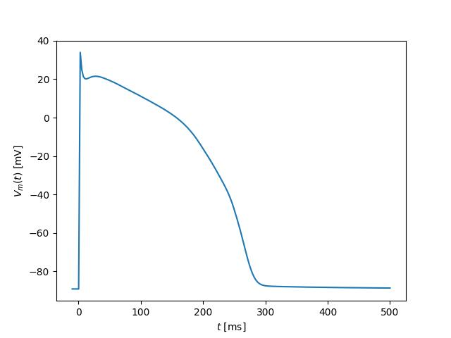

# Cardiomyocyte emulator

This repository demonstrates the pretrained emulator of the paper *Neural network emulation of the human ventricular cardiomyocyte action potential: a tool for more efficient computation in pharmacological studies*, which can be found following the link [TODO](TODO.html).

# Installation

The repository provides a python package that can be installed using `setuptools`. Note that you need a valid python environment that can run the dependencies ([pytorch](pytorch.org) among others). A possible way to ensure this is by using a python environments, such as [venv](https://docs.python.org/3/library/venv.html) or [conda](https://docs.conda.io/en/latest/).

The installation itself can then by simple achieved by cloning the repo and installing it through
```bash
pip install .
```

# Usage example

```python
import numpy as np
import matplotlib.pyplot as plt
from cardiomyocyte_emulator import load_default_emulator_model
emulator = load_default_emulator_model(device="cpu") #Load the pretrained emulator on the CPU
max_conds_default = emulator.max_conds_center #Use the default maximum conductances
t = np.linspace(-10, 500, num=200) #Create a time range which we will emulate
ap_emu = emulator.forward_latent_np(t, max_conds_default) #Emulation

plt.figure()
plt.plot(t, ap_emu[0])
plt.ylabel("$V_m(t)$ [mV]")
plt.xlabel("$t$ [ms]")
plt.show()
```



# Demos

Additional demos are provided in the [demos directory](demos) for more use cases. To run the demos, additional packages might be required, which can be installed through the command

```bash
pip install .[demos]
```

The demos are provided as [jupyter-notebooks](https://jupyter.org)

# License

The package uses the open-source AGPL license.

# Citation

If you use the software for scientific projects, please cite our associated publication
```bibtex
TODO
```
